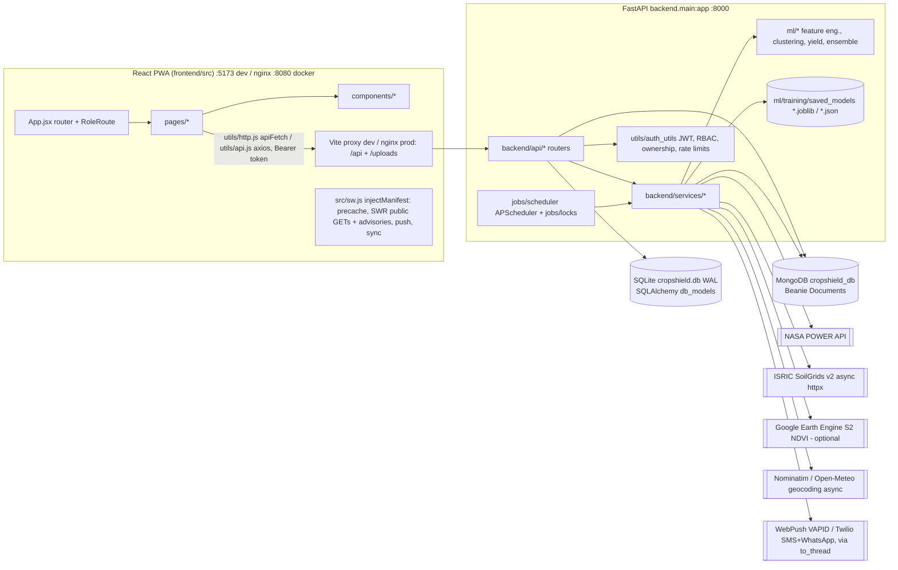
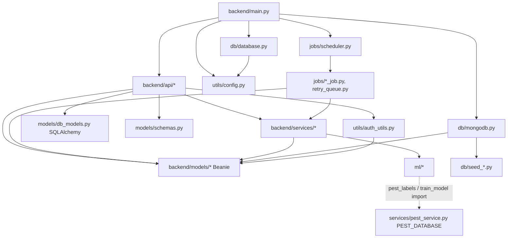
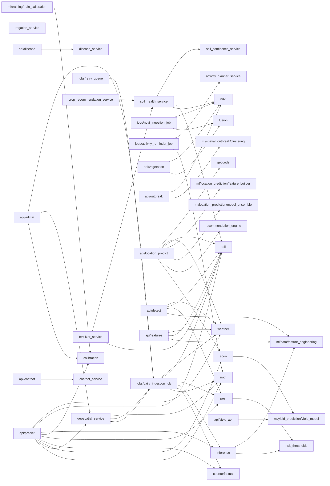

# CLAUDE.md — CropShield / AgriGuard AI

> **Purpose of this file:** a complete, self-contained map of this repository so an AI agent can work on it
> **without re-scanning every file**. It covers what the system does, how requests flow, every module and its
> dependencies, the frontend↔backend contract, data/ML artifacts, and verified gotchas.
> Originally written against commit `55bfc2a` (branch `main`), then updated for branch `fix/audit-remediation`.
> That branch added auth + ownership everywhere, a real-NASA-POWER model retrain, idempotent jobs, isolated tests and a
> working Docker setup. If code and this file disagree, trust the code and update this file.

---

## 0. TL;DR for agents

- **Product:** AI pest-and-disease early-warning platform for farmers in Tamil Nadu, India. It has 3 roles (farmer / agronomist / admin) and 5 UI languages (en, ta, hi, te, ml).
- **Names:** the repo is **CropShield**, but the UI, API title and most docstrings say **AgriGuard AI**. They are the same product.
- **Stack:** FastAPI (Python **3.12**) backend on `:8000`, React 18 + Vite + Tailwind PWA frontend on `:5173`. In dev, Vite proxies `/api` and `/uploads` to the backend. In Docker, nginx does that (`deploy/nginx.conf`).
- **Two databases at once (important):**
  - **MongoDB via Beanie** (`backend/models/*.py`, except `db_models.py` and `schemas.py`). This is the primary store and the **source of truth for users**.
  - **SQLite via SQLAlchemy** (`backend/models/db_models.py`, file `./cropshield.db`, **git-ignored/untracked**). This is the legacy store, still written by `/predict-today`, `/detect`, `/yield/predict` and read by `/history`. The login fallback migrates legacy SQLite users into Mongo.
- **All routes live under `/api/v1`.** Swagger is at `http://localhost:8000/api/v1/docs`.
- **Auth (contract):**
  - Every user-data endpoint needs `Authorization: Bearer <jwt>`. Missing, invalid or expired → 401; wrong role or not the owner → 403; unknown id → 404.
  - The JWT is signed with `SECRET_KEY` from the environment. With `APP_ENV=production` the app refuses to start without it; in dev a random per-process key is used.
  - `/auth/register` always creates a `farmer`. Login is by email only. There are **no "first farm in the DB" fallbacks** anywhere.
  - See §5 and `E:\Claude\PDP\temp\remediation\CONTRACT.md`, the cross-team contract used for the remediation.
- **Main pipeline:** `POST /api/v1/predict-today` runs these steps:
  1. NASA POWER weather (35-day window, tagged `NASA_POWER` or `synthetic`)
  2. The **shared** feature pipeline (`ml/data/feature_engineering.py`, identical to training)
  3. XGBoost + SHAP
  4. Platt calibration
  5. Rule-based pest detection
  6. Counterfactual prescription
  7. ₹ economic impact
  8. Persist to SQLite, plus an idempotent Mongo upsert on the caller's own farm
  9. 5 km neighbour alerts, sent only for real weather and deduped per day, plus a notification to the farm owner
- **What degrades, and how it is flagged:**
  - NASA down: synthetic climatology, flagged `data_quality.is_synthetic`. It never alerts, and the daily job retries instead of storing.
  - Model or feature mismatch: the documented rule index, flagged `model_version="rules-fallback-v2"`.
  - No disease weights: `model_available:false` with `confidence:null` and no treatment.
  - No Earth Engine: simulated NDVI.
  - No Twilio: simulated SMS, sent only to real saved phone numbers.
  - No VAPID keys: push is disabled.
  - Admin "retrain", analytics and regional grid/report return `simulated:true`.
- **Demo logins** are seeded only by `scripts/init_mongo_db.py`, or by Docker with `SEED_DEMO_DATA=true`. They are pre-filled on the login page:
  `farmer@cropshield.org / farmer123`, `agronomist@cropshield.org / agro123`, `admin@cropshield.org / admin123`. Never seed them on a public deployment.
- **Do not start servers, push, or run tests against Mongo unless the user asks.**
  - Tests use an **isolated** DB (`cropshield_test`, dropped afterwards) and a temp SQLite file.
  - They skip when MongoDB is unreachable.
  - `tests/test_feature_alignment.py` and the other pure unit tests need no DB.

---

## 1. Repository layout

```
CropShield/
├── backend/                  FastAPI app (package `backend`)
│   ├── main.py               App factory, router registration, lifespan (Mongo init → thresholds → scheduler)
│   ├── api/                  22 routers (one file per feature), all mounted at /api/v1
│   ├── services/             Business logic / ML inference / external APIs (+ risk_thresholds.py)
│   ├── models/               Beanie Mongo Documents (26) + db_models.py (SQLAlchemy) + schemas.py (Pydantic I/O, GeoJSON validators)
│   ├── db/                   database.py (SQLite, WAL), mongodb.py (Motor/Beanie + pre-index migrations), mongo_helpers.py, CSV auto-seeders
│   ├── jobs/                 APScheduler jobs + locks.py (in-process asyncio locks)
│   ├── utils/                config (pydantic-settings), auth_utils (JWT/RBAC/ownership/rate limits), uploads.py, i18n errors, JSON sanitizer
│   ├── config/settings.py    Re-export shim of utils/config.py
│   ├── scripts/              Older duplicates of some seed scripts (prefer /scripts)
│   ├── requirements.txt      Complete runtime deps (pinned to the model artifacts); requirements-dev.txt adds pytest
│   └── Dockerfile            python:3.12-slim, CPU torch, non-root, no training at start
├── ml/                       Training + model code (package `ml`)
│   ├── data/                 collect_nasa_historical.py, feature_engineering.py (shared train/live), pest_labels.py, LABELING.md,
│   │                         nasa_power_raw/ (REAL NASA POWER 2005–2024, 10 sites), legacy_synthetic/ (old synthetic CSVs, unused),
│   │                         wadhwani_bollworm/ (no date/location → unusable for labels)
│   ├── training/             train_model.py (THE trainer), train_calibration.py, train_multicrop_model.py (shim), saved_models/, plots/
│   ├── disease_detection/    Custom CNN (model.py), dataset loader, training; saved_models/disease_model.pth (not used by the API)
│   ├── location_prediction/  feature_builder.py + model_ensemble.py (heuristic "ensemble")
│   ├── spatial_outbreak/     clustering.py (hard-coded TN hotspots + exp-decay kernel)
│   ├── yield_prediction/     yield_model.py (formula on official TN DES base yields) + train_yield_model.py (RF, not used at runtime)
│   └── xai/                  shap_explainer.py, counterfactual_explainer.py (offline/legacy helpers)
├── frontend/                 React 18 + Vite 5 + Tailwind 3 + react-leaflet + recharts + i18next + PWA (injectManifest, src/sw.js)
│   ├── vite.config.js        Dev server :5173, proxy /api + /uploads → VITE_API_BASE_URL || http://127.0.0.1:8000
│   ├── Dockerfile            Legacy `serve -s dist` image (NOT used by compose: it does not proxy /api)
│   └── src/
│       ├── main.jsx, App.jsx Router, role guards, navbar, footer, global widgets, route ErrorBoundary
│       ├── pages/            Pages (TodayPage/DetectPage deleted)
│       ├── components/       Components (+ ui/DemoDataBadge, ui/ErrorBoundary, ui/Toast)
│       ├── utils/            http.js (apiFetch + session), api.js (axios, same token), farms.js, offlineQueue.js, useLocalizedField.js
│       ├── i18n.js           i18next setup, namespaces: common, auth, farmer, agronomist, admin, validation
│       └── locales/{en,ta,hi,te,ml}/*.json
├── deploy/                   frontend.Dockerfile (Vite build → nginx) + nginx.conf (SPA + /api,/uploads proxy)
├── scripts/                  init_db.py (SQLite seed), init_mongo_db.py (Mongo seed + demo users), other seeders
├── tests/                    pytest + pytest-asyncio; conftest.py isolates DBs (see §11)
├── data_collection/          One-off data fetch/clean scripts (SoilGrids, Wadhwani bollworm, crop yield)
├── saved_models/             Calibration report + disease class_names.json (runtime lookup dir)
├── docs/                     SYSTEM_DESIGN, MODEL_DOCS, USER_MANUAL, DEPLOYMENT_GUIDE (secrets, nginx), patent/literature/demo docs
├── *.csv (root)              Datasets used by seeders and demo endpoints (see §10)
├── cropshield.db             Local SQLite file (untracked, git-ignored; created at startup)
├── config/.env.example       Copy to config/.env (Settings reads env_file="config/.env"); placeholders only, no secrets
├── docker-compose.yml        mongo (127.0.0.1), mongo-express (--profile tools), backend (127.0.0.1:8000), frontend nginx (:8080)
├── .dockerignore             Excludes .git, secrets, *.db, uploads, node_modules, training-only data
├── run_all.bat / run_backend.bat / run_frontend.bat   Windows launchers (run_backend creates config/.env, warns on missing SECRET_KEY)
└── uploads/                  Runtime uploads (served at /uploads), uuid filenames only
```

**Root-level duplicates:** `clean_crop_yield_data.py`, `fetch_soilgrids.py` and the root `agriguard_*_10000rows.csv` files duplicate files in `data_collection/` and `ml/data/legacy_synthetic/`. **Nothing at runtime reads the root `agriguard_*` CSVs.** The backend reads the other root CSVs (see §10).

---

## 2. Tech stack, dependencies and running

### Backend (Python 3.12)
`backend/requirements.txt` is **complete** for the runtime:
- **Web and auth:** fastapi 0.111, uvicorn, pydantic 2.7+, pydantic-settings, python-dotenv, python-multipart, httpx, requests, **PyJWT**, **bcrypt**.
- **Databases:** motor 3.x, beanie 1.x (<2), dnspython, sqlalchemy 2.0.
- **Jobs and notifications:** **apscheduler 3.x**, **pywebpush**, **tzdata**.
- **ML:** numpy 2, **pandas 3**, **scikit-learn 1.8.x**, **xgboost ≥3.2**, shap, joblib, matplotlib.
- **Disease model:** **torch**, **torchvision**, **Pillow**.

`twilio` and `earthengine-api` are listed but commented out; they are optional and lazily imported. `backend/requirements-dev.txt` adds pytest and pytest-asyncio 0.23.

- The ML pins must match the committed artifacts. `scaler.joblib` is a pickled scikit-learn object, and the model was trained with xgboost 3.2 / sklearn 1.8 / pandas 3.0. Retrain if you bump them.
- `torch` is **not optional**: `api/disease.py` imports `disease_service`, which imports torch/torchvision at module level. The Dockerfile installs CPU wheels from the PyTorch index first.
- Removed as unused: alembic, psycopg2-binary, aiofiles, pyarrow, geopy.

### Frontend (Node)
`frontend/package.json`:
- **Runtime:** react 18.3, react-dom, react-router-dom 6.23 (v7 future flags on), axios, clsx, framer-motion, i18next 26 + react-i18next 17 + browser-languagedetector, leaflet 1.9 + react-leaflet 4.2, lucide-react, recharts 2.12.
- **Dev:** vite 5, @vitejs/plugin-react, vite-plugin-pwa (injectManifest), workbox-* 7.4, tailwindcss 3.4, postcss, autoprefixer, eslint 8.

### Commands (run from repo root unless noted; **only when the user asks**)
```bash
# backend
pip install -r backend/requirements.txt           # (+ backend/requirements-dev.txt for tests)
cp config/.env.example config/.env                # set SECRET_KEY (>=16 random chars)
python -m scripts.init_mongo_db          # seed Mongo: demo users, farms, advisories, treatments, support requests (dev only)
python -m scripts.init_db                # seed SQLite soil_profiles + pest_references (optional)
python -m scripts.seed_districts         # 38 TN district reference farms (is_reference_point=True, no owner)
python -m scripts.seed_chatbot_intents   # chatbot intents (needed for /chatbot/ask)
uvicorn backend.main:app --reload --port 8000        # or run_backend.bat
# frontend
cd frontend && npm install && npm run dev            # or run_frontend.bat; run_all.bat launches both
# ML (optional; artifacts are committed)
python -m ml.data.collect_nasa_historical            # re-download NASA POWER 2005–2024 into ml/data/nasa_power_raw/
python -m ml.training.train_model                    # THE trainer (~18 min): model, scaler, feature_names, metrics, Platt params
# tests (isolated DB cropshield_test; DB tests skip without MongoDB; network tests need CROPSHIELD_TEST_NETWORK=1)
python -m pytest tests -q
python -m pytest tests/test_feature_alignment.py -q  # pure unit test, no DB
# docker (needs SECRET_KEY in ./.env)
docker compose up --build                            # web on :8080 (nginx), API on 127.0.0.1:8000
```

### Configuration (`backend/utils/config.py`, `Settings`, env file `config/.env`; env vars win)
| Setting | Notes |
|---|---|
| `APP_ENV` | `production`/`prod` → `settings.is_production`. Enforces `SECRET_KEY` and skips demo P&L CSV seeding. |
| `SECRET_KEY` | JWT HS256 secret, ≥16 chars, and not one of the known placeholders. Resolved in `auth_utils._resolve_secret_key()`. |
| `MONGODB_URL`, `MONGODB_DB_NAME` | Default `mongodb://localhost:27017/cropshield_db` / `cropshield_db`. |
| `DATABASE_URL` | Default `sqlite:///./cropshield.db`. Compose uses `/app/data/cropshield.db`. |
| `CORS_ORIGINS` | **A string**: comma-separated or a JSON array. Parsed by `settings.cors_origins_list`. Default `http://localhost:5173,http://127.0.0.1:5173`. |
| `VAPID_PUBLIC_KEY`, `VAPID_PRIVATE_KEY`, `VAPID_CLAIMS_SUB` | Keys are env-only (default empty → `settings.push_enabled == False`). |
| `TWILIO_ACCOUNT_SID/AUTH_TOKEN/PHONE_NUMBER/WHATSAPP_NUMBER` | Optional. Without them, delivery is simulated. |
| `NASA_POWER_BASE_URL`, `MODEL_PATH`, `SCALER_PATH`, `FEATURE_NAMES_PATH`, `DEFAULT_LATITUDE/LONGITUDE/LOCATION` | As before. |

Docker Compose only: `SEED_DEMO_DATA` (default false), `FRONTEND_PORT` (8080), `MONGO_EXPRESS_USER/PASSWORD`.
Tests only (read by `tests/conftest.py`): `CROPSHIELD_TEST_DB`, `CROPSHIELD_TEST_MONGODB_URL`, `CROPSHIELD_TEST_NETWORK`, `CROPSHIELD_TEST_KEEP_DB`.
All paths are **relative to the CWD**, so always run from the repo root.

---

## 3. System architecture



### Startup sequence (`backend/main.py`)
1. **At import time:**
   - `Base.metadata.create_all(engine)` creates the SQLite tables, then `auto_migrate_sqlite()` runs `ALTER TABLE ADD COLUMN`.
   - The SQLite connect event sets WAL, `busy_timeout=15000` and `synchronous=NORMAL`.
   - Importing `backend.main` therefore creates or touches `DATABASE_URL`. Tests point it at a temp file.
2. **Lifespan startup:**
   - `init_mongodb()`:
     - `_pre_index_migrations` abandons duplicate pending retry-queue items.
     - `init_beanie(DOCUMENT_MODELS)` builds the indexes, including the partial unique dedupe indexes (§6.4).
     - Auto-seeds the crop rules/costs (root CSVs) and the Kc + NPK data when those collections are empty.
     - **If Mongo init fails, the scheduler is NOT started** (the error is logged).
   - `load_risk_thresholds()` loads the admin thresholds into the in-process cache (defaults 35/65).
   - `seed_pnl_demo_data()` runs only when `APP_ENV` is not production.
   - `start_scheduler()` is idempotent and returns a bool. It registers these jobs (timezone Asia/Kolkata, `misfire_grace_time=3600, coalesce=True, max_instances=1`):
     - 04:00 every 3 days → `run_ndvi_ingestion_job`
     - 05:00 daily → `run_daily_ingestion_job`
     - 06:00 daily → `run_activity_reminder_job`
     - hourly → `run_retry_queue_worker`
     - every 15 min → `run_queued_notification_delivery` (delivers quiet-hours-queued notifications)
3. **Middleware:**
   - CORS allows `settings.cors_origins_list` only, with explicit methods and headers.
   - GZip (≥1000 B).
   - Static mount: `/uploads` → `./uploads` (public; files are protected only by unguessable uuid names).
4. **Health:** `GET /`, `GET /health`, `GET /api/v1/health` (the canonical one, used by OfflineBanner and the Docker healthcheck).

---

## 4. Core flow: `POST /api/v1/predict-today` (`backend/api/predict.py`)

Request `TodayWarningRequest`: `{latitude=9.1728, longitude=77.8710, location="Kovilpatti", crop (required), climate_zone="Dryland", farm_id=null}`.
- **Auth required.** The prediction is attributed to `farm_id`, which must be owned by the caller, or else to the caller's primary farm. If there is neither, nothing is written to Mongo.
- Rate limit: 30 calls per 5 min per user (429).
- Valid zones: `Dryland | Irrigated | Delta | Semi-arid | Humid`. Valid crops: `Cotton | Rice | Sorghum | Millets | Sugarcane | Pulses` (aliases paddy/millet/pulse).

```mermaid
sequenceDiagram
  participant FE as FarmerDashboard
  participant P as api/predict.py
  participant W as weather_service
  participant S as soil_service
  participant I as inference_service
  participant FEAT as ml/data/feature_engineering
  participant C as calibration_service
  participant PS as pest_service
  participant CF as counterfactual_service
  participant EI as economic_impact_service
  participant G as geospatial_service
  participant N as notification_service
  FE->>P: POST /predict-today (Bearer, farm_id)
  P->>W: fetch_latest_weather(lat,lon,35d) → df.attrs["source"] = NASA_POWER | synthetic (seeded per location/day)
  P->>S: get_soil_profile(zone), get_soil_risk_multiplier(soil,crop)
  Note over P: steps below run in ONE asyncio.to_thread (CPU-bound)
  P->>I: predict_today(df, soil, crop, zone)
  I->>FEAT: build_live_feature_row → build_feature_frame (clean → engineer → crop one-hot), 46 MODEL_FEATURES
  I-->>P: score = P(Med)*0.5 + P(High)*1.0; level via risk_thresholds (default <35 Low, <65 Medium, else High); top SHAP; version
  Note over I: any trained feature missing/non-finite → FeatureMismatchError → documented rule index, model_version="rules-fallback-v2" (never zero-fill)
  P->>I: predict_proba_today → C: calibrate_prediction (Platt JSON params) → calibrated confidence + band + calibration_method (skipped for rules-fallback)
  P->>PS: detect_pests(crop, fe_row, soil)
  P->>CF: generate_counterfactual_prescription
  P->>EI: get_economic_impact_for_prediction → Treat Now/Soon/Monitor/No Action
  P->>P: INSERT SQLite pest_warning_logs (in a thread)
  P->>P: upsert_pest_warning_log(farm, date, source="predict_today") — one row per farm/day; never overwrites a verified row
  alt risk High AND weather_source == NASA_POWER
    P->>G: dispatch_5km_regional_alerts(..., weather_source) → atomic Alert upsert per (origin, neighbour, IST date, type); notify only newly inserted, owned neighbours
  end
  alt economic recommendation == "Treat Now" AND farm.owner_id AND not synthetic
    P->>N: notify_farmer(farm.owner_id, "treat_now_recommendation", 5-language text)
  end
  P-->>FE: TodayWarningResponse (+ data_quality)
```

Response `TodayWarningResponse`:
- **Identity:** `warning_id, warning_date, location, crop, climate_zone, farm_id`
- **Risk:** `is_warning, risk_score, risk_level, alert_message, likely_pests[]`
- **Explanation:** `top_features[]` (SHAP), `shap_interpretation, shap_explanation, counterfactual_prescription, economic_impact, weather_snapshot`
- **Confidence:** `raw_confidence, calibrated_confidence, confidence_band, model_calibration_version, calibration_method, is_rule_fallback`
- **Provenance:** `data_date, model_version, data_source`, **`data_quality {weather_source, is_synthetic}`**

**Side effects:** `/farmer/today` calls this endpoint on every load. The Mongo log is an upsert per farm per day, and neighbour alerts are deduped per IST day, so a refresh does not duplicate rows or re-alert.

### Other key flows
- **Daily ingestion job** (`jobs/daily_ingestion_job.py`):
  - Holds `jobs/locks.ingestion_lock`, shared with the retry worker and admin run-now. A concurrent run returns `status:"skipped"` (409 from the admin endpoints) and logs a `JobRunLog`.
  - For every Mongo `Farm` it fetches weather. **Synthetic weather raises `SyntheticWeatherError`**, so the farm goes to the `RetryQueue` and nothing is stored or alerted.
  - It upserts the `WeatherSnapshot` (with the real source) and runs inference, pest detection and the counterfactual in one `to_thread`.
  - It upserts a `PestWarningLog(source="daily_job", verified_by=None)`, which fills the agronomist queue, then dispatches the 5 km alerts.
  - `RetryQueue`: `enqueue_retry` upserts one pending item per farm. The hourly worker claims items atomically (pending → processing) and reclaims stale ones after 1 h.
  - `geospatial_service.run_daily_prediction_pipeline_for_all_farms` (used by `/admin/run-daily-predictions`) now delegates to this job.
- **NDVI job** (`jobs/ndvi_ingestion_job.py`):
  - For each farm, `ndvi_service.fetch_ndvi_for_farm_async` (Earth Engine or `_simulate_sentinel2_ndvi`) → `derive_vegetation_status` → upsert `VegetationSnapshot` → `fusion_service.compute_fused_health_score`.
  - Fusion weights are 50/30/20, redistributed when a signal is missing. A healthy leaf class adds health = confidence, a disease class adds 1 − confidence, and the image is skipped when the model is unavailable.
- **Verification loop (3 roles):**
  - A farmer's prediction or the job creates a `PestWarningLog` (`verified_by=None`).
  - The agronomist sees it in `GET /detect/pending`; with no real items this returns demo items with `simulated:true`.
  - The agronomist resolves it with `POST /detect/{log_id}/verify`: 404 for unknown or demo ids, 409 if already verified. This writes a queued `RetrainingLog`.
  - `POST /admin/models/retrain` is **simulated**: `status:"simulated"`, `new_accuracy:null`. Real retraining is offline.
  - Test: `tests/test_full_system_loop.py`.
- **Draw-to-Scan** (`api/outbreak.py`):
  - `POST /outbreak/scan-area` (auth; body is a validated GeoJSON Polygon) runs a `$geoWithin` query (cap 500 farms, else HTTP 422). Farms that are neither the caller's nor reference points are shown as "Neighbouring farm".
  - `POST /outbreak/scan-area/broadcast-advisory` is agronomist/admin only.
- **Location predict** (`api/location_predict.py`, public): `geocoding_service.geocode_location_async` (offline TN dictionary, then Nominatim) → weather → `ml.location_prediction.*` heuristic ensemble → recommendations and economic impact.
- **Soil Health** (`api/soil_health.py` → `services/soil_health_service.py`):
  - Farm polygon → area + centroid → ISRIC SoilGrids v2 (`fetch_soilgrids_with_quantiles_async`, run concurrently with the terrain fetch) → `soil_confidence_service` → `SoilHealthReport`.
  - A lab report upload (owner only, ≤10 MB, uuid name) overrides it. `get_effective_soil_data(farm_id)` = lab report, else preliminary report, else zone profile.
  - The SoilGrids fallback is labelled "Regional Agro-climatic Profile Estimate".
- **Crop recommendation, irrigation, fertilizer:** unchanged logic (see §6.3). The routes now require auth plus farm ownership, and staff can read (§5).
- **Activity planner** (`activity_planner_service`):
  - Builds a full-season timeline.
  - Status refresh is atomic per item (`$set` with arrayFilters).
  - The reminder job holds a lock and claims reminders per item per IST day (`last_notified_date`), and weather warnings per plan per day (`reminder_markers`).
  - `/activity-planner/run-reminders-now` is admin-only.
- **Chatbot** (`chatbot_service`): **deterministic, no LLM.** `/chatbot/ask` requires auth, and its `farm_id` must be owned (staff may use any). `/chatbot/query` and `/chatbot/intents` are public.
- **Notifications** (`notification_service.notify_farmer`):
  - Skips when `user_id` is None.
  - Quiet hours are evaluated in **Asia/Kolkata** as `[start, end)`, default 21:00–06:00. Only `high_risk` bypasses them; other events are queued and delivered by the 15-minute job.
  - Channel order:
    1. Web Push, only if VAPID keys are set. Subscriptions are pruned on 404/410.
    2. SMS/WhatsApp, **only when the preference has a real phone**: there is no default number, and the placeholder `+919876543210` is rejected.
  - Twilio and pywebpush run in `asyncio.to_thread` with 10 s timeouts. Every attempt is written to `NotificationLog`.
- **Disease scan** (`api/disease.py`):
  - Auth is required. The upload (≤10 MB, extension-checked, uuid name) goes to `uploads/disease_images/`, then `disease_service.disease_detector.predict` runs in a thread.
  - **`saved_models/disease_detection/best_model.pt` is not committed**, so the response is `status:"model_unavailable", model_available:false, is_heuristic:true`, with confidence, class and treatments set to null, plus a `message`. Nothing is persisted.
  - With weights, predictions are restricted to the `crop_hint` crop's classes.

---

## 5. Backend API index (all prefixed with `/api/v1`)

Auth legend: 🔓 public · 👤 optional user · 🔐 any logged-in user · F/A/Ad = farmer/agronomist/admin role (`require_roles`) · **own** = farm ownership enforced via `get_owned_farm` (admins always pass; "staff read" = agronomists may read).
Error contract: 401 = missing, invalid or expired token; 403 = wrong role or not the owner; 404 = unknown or invalid id; 409 = job already running or case already verified; 413 = upload >10 MB; 422 = validation. `detail` may be a string or a list (422).

| Router file | Routes | Auth | Main dependencies |
|---|---|---|---|
| `auth.py` | `POST /auth/register` (role ignored → farmer, password ≥8), `POST /auth/login` (email only; 10 failures per 5 min per email+IP → 429), `GET /auth/me` (token user; no `username` param), `PUT /users/me/language` | 🔓 / 🔓 / 🔐 / 👤 | Mongo `User` (truth); a legacy SQLite user is migrated on login; bcrypt via `to_thread`; legacy SHA256 hashes are re-hashed on login |
| `predict.py` | `POST /predict-today` | 🔐 + own `farm_id` | see §4 |
| `location_predict.py` | `POST /predict-location` | 🔓 | geocoding (async), weather, soil, `ml.location_prediction.*`, recommendation_engine, economic_impact |
| `detect.py` | `POST /detect` | 🔐 | weather, soil, pest_service; SQLite `PestDetection` |
| `features.py` | `GET /features` | 🔓 | weather, soil, `engineer_features` |
| `weather.py` | `GET /weather/current` | 🔓 | weather_service (router included **before** agronomist, so `/weather/current` is no longer shadowed) |
| `history.py` | `GET /history` | 🔓 | SQLite `PestWarningLog` |
| `farmer.py` | `GET /farms/me` (404 if none), `GET /farmer/profile` (`farm` or null), `GET /farms` = `GET /farmer/farms` (own farms; admin/agronomist: all), `POST /farms`, `PUT/DELETE /farms/{id}` (own), `GET /history/me`, `GET/POST /treatments`, `GET /advisories` (🔓, regex-escaped search), `GET /alerts/me`, `POST /support/requests`, `GET /support/requests/me` | F/Ad (profile, farms list: 🔐) | Mongo Farm, PestWarningLog, Treatment, PestDiseaseAdvisory, Alert, SupportRequest, User |
| `agronomist.py` | `GET /detect/pending` (`simulated` flag), `POST /detect/{log_id}/verify` (404/409), `GET /weather/{farm_id}` (no demo fallback), `GET /outbreak/regional-grid` (simulated), `GET /reports/regional?range=` (simulated), `GET /advisories/farmer-requests?status=pending\|resolved\|all`, `POST /advisories/farmer-requests/{id}/respond` (404 on unknown) | A/Ad | Mongo PestWarningLog, RetrainingLog, SupportRequest, Farm; weather_service |
| `admin.py` (prefix `/admin`) | `GET/POST /pests-diseases`, `DELETE /pests-diseases/{id}`, `GET /farms` (A too), `POST /farms`, `GET/POST /users`, `PUT /users/{id}` (roles Literal; no self-demote or self-deactivate), `GET/PUT /thresholds` `{low_max, medium_max}`, legacy `GET/PUT /alert-thresholds`, `POST /advisories`, `GET /api-status`, `POST /jobs/run-ingestion-now` (409 if running), `GET /analytics` (simulated sections), `POST /run-daily-predictions`, `POST /models/retrain` (simulated), `GET /models/status`, `GET /model-calibration` | Ad | daily_ingestion_job, risk_thresholds, calibration_service, metrics.json |
| `vegetation.py` | `GET /vegetation/{farm_id}` (own, staff read; `persisted` flag; no writes on GET), `GET /vegetation` (farmers see own farms) | 🔐 | ndvi_service (async), fusion_service |
| `disease.py` | `POST /disease/detect` (multipart `file`, `crop_hint`, `farm_id`), `GET /disease/recent` | 🔐 | disease_service singleton; utils/uploads |
| `yield_api.py` | `POST /yield/predict` (`confidence_score` may be null; unknown crop → 422) | 🔐 | `ml.yield_prediction.yield_model`; SQLite `YieldPredictionLog` |
| `outbreak.py` | `GET /outbreak/heatmap`, `POST /outbreak/spatial-risk`, `POST /outbreak/scan-area`, `POST /outbreak/scan-area/broadcast-advisory` | 🔓 / 🔓 / 🔐 / A+Ad | clustering, ndvi_service; Farm, PestWarningLog, VegetationSnapshot, Alert |
| `chatbot.py` | `POST /chatbot/ask` (own farm_id), `GET /chatbot/intents?lang=`, `POST /chatbot/query` | F/A/Ad / 🔓 / 🔓 | chatbot_service |
| `alerts.py` | `POST /alerts/send` (mock, `status:"simulated"`) | A/Ad | none |
| `notifications.py` (prefix `/notifications`) | `GET /vapid-public-key` (🔓; `{public_key:null, push_enabled:false}` without keys), `GET/PUT /preferences`, `POST /subscribe`, `POST /unsubscribe`, `POST /test`, `GET /logs` | 🔐 | notification_service |
| `crop_recommendation.py` (prefix `/crop-recommendation`) | `POST /generate`, `GET /history` (🔐), `GET /demo-scenarios`, `GET /rules`, `GET /cost-templates` (🔓), `POST/PUT/DELETE /rules[/{id}]`, `/cost-templates[/{id}]` (Ad) | mixed | crop_recommendation_service |
| `irrigation.py` | `GET /irrigation/{farm_id}` (own, staff read), `GET /irrigation/coefficients/all` (🔓), `POST /irrigation/coefficients`, `DELETE /irrigation/coefficients/{id}` (Ad) | F/A/Ad | irrigation_service |
| `fertilizer.py` | `GET /fertilizer/{farm_id}` (own, staff read), `GET /fertilizer/requirements/all` (🔓), `POST/DELETE /fertilizer/requirements` (Ad) | F/A/Ad | fertilizer_service |
| `activity_planner.py` | `POST /activity-planner/generate` (F/Ad, own), `GET /activity-planner/{farm_id}` (F/A/Ad), `POST …/activities/{id}/complete` (F/Ad), `POST /activity-planner/run-reminders-now` (Ad, 409 if running) | see route | activity_planner_service, activity_reminder_job |
| `soil_health.py` (prefix `/soil-health`) | `POST /generate`, `POST /{farm_id}/upload-lab-report` (F/Ad, own), `GET /{farm_id}/effective`, `GET /{farm_id}/history` (read roles), `POST /seed-demo-data` (Ad) | see route | soil_health_service |
| `pnl.py` | `POST /expenses`, `POST /expenses/receipt-upload` (→ `{url:"/uploads/receipts/<uuid>.<ext>"}`), `GET /expenses/{farm_id}`, `DELETE /expenses/{id}`, `POST /revenue`, `GET /revenue/{farm_id}`, `GET /farm-pnl/{farm_id}` (404 for unknown farm; no write on GET), `GET /admin/prediction-accuracy` (Ad), `POST /pnl/seed-demo-data` (Ad) | F/Ad + own | pnl_service. Amounts: 0 < x ≤ 1e9. `category` ∈ seeds/fertilizer/labor/irrigation/pesticides/other. `receipt_photo_url` must match the upload URL. `crop_type` defaults to "General". |

---

## 6. Backend module dependency graph

### 6.1 Package-level

Note the **cross-package dependency**: training (`ml/data/pest_labels.py`) imports `backend.services.pest_service.PEST_DATABASE` for its labels, and backend services import `ml.*` (feature pipeline, yield model). Both packages must be importable from the repo root. `feature_engineering.py` itself imports only numpy and pandas.

### 6.2 Service-level (who calls whom)


### 6.3 Per-file reference: `backend/services/`
| File | Public API | Depends on | Notes |
|---|---|---|---|
| `weather_service.py` | `async fetch_latest_weather(lat,lon,days_back=35)→DataFrame`, `get_weather_source(df)`, `is_synthetic_weather(df)`, `SyntheticWeatherError`, `get_today_weather_dict(df)` (includes `weather_source`), `_fallback_weather`, `_compute_et0` | httpx, config, serialization | NASA community AG (same units as training). `df.attrs["source"]` is `"NASA_POWER"` or `"synthetic"`, plus `fallback_reason`. The fallback uses a local RNG seeded per (lat, lon, day), never the global RNG. `.ffill().bfill()` (pandas 3 safe). |
| `inference_service.py` | `model_manager` (thread-safe singleton), `predict_today(...)`, `predict_proba_today`, `build_model_input` (raises `FeatureMismatchError`), `predict_pest_risk`, `score_to_risk_level`, `RULES_FALLBACK_VERSION="rules-fallback-v2"`, `build_shap_interpretation` | joblib, shap, feature_engineering, risk_thresholds | Loads once under a lock; SHAP calls are serialised. **No zero-fill**: a missing feature gives the flagged rule index. Thresholds come from `risk_thresholds.get_risk_thresholds()` (0–100, default 35/65). All functions are synchronous: call them via `asyncio.to_thread`. |
| `risk_thresholds.py` | `get_risk_thresholds()` (sync, cached), `async load_risk_thresholds()`, `async save_risk_thresholds()` | Mongo `platform_settings` (`_id:"risk_thresholds"`) | Backs `GET/PUT /admin/thresholds` `{low_max, medium_max}` and the legacy `/admin/alert-thresholds`. |
| `calibration_service.py` | `fit_platt_calibrator`, `evaluate_calibration`, `plot_reliability_diagram`, `load_calibrated_model`, `get_calibration_report`, `derive_confidence_band`, `calibrate_prediction` | numpy, matplotlib(Agg, lazy) | Platt params live in `ml/training/saved_models/calibration_params.json` (JSON, no pickle). Each result carries `calibration_method` ("platt" or "analytic-fallback") and `model_calibration_version` ("2.0.0-platt" or "0.0.0-analytic-fallback"). It no longer invents values for empty reliability bins. |
| `soil_service.py` | `SOIL_PROFILES` (5 zones), `get_soil_profile(zone)`, `get_soil_risk_multiplier(soil,crop)` (0.8–1.3) | none | Static, literature-based. |
| `pest_service.py` | `PEST_DATABASE`, `detect_pests(crop, weather_features, soil_features)`, `get_pest_list`, `get_overall_detection_status` | risk_thresholds | Rule engine, 17 pests across 6 crops. **It is also the source of the training labels** (`ml/data/pest_labels.py`), so changing a threshold requires a retrain. |
| `counterfactual_service.py` | `generate_counterfactual_prescription(crop, risk_score, risk_level, weather_snapshot, top_features)` | none | Heuristic RH-reduction "inverse optimization". |
| `economic_impact_service.py` | `compute_economic_impact(...)`, `async get_economic_impact_for_prediction(...)` | MarketPrice, PestDiseaseAdvisory, yield_model | Recommendation ∈ Treat Now / Treat Soon / Monitor Only / No Action Needed. |
| `geospatial_service.py` | `haversine_distance_km`, `async find_farms_within_radius`, `async dispatch_5km_regional_alerts(origin_farm, threat_name, risk_level, radius_km=5, weather_source=None, skip_if_synthetic=True)`, `async run_daily_prediction_pipeline_for_all_farms` (delegates to the daily job) | Farm, Alert, notification | Uses an atomic Alert upsert keyed on (origin_farm_id, farm_id, IST alert_date, type) and notifies only newly inserted alerts on owned farms. Synthetic weather means no dispatch. |
| `notification_service.py` | `has_real_phone`, `is_quiet_hours(qh, now=None)` (IST), `get_or_create_preferences` (no phone), `log_notification`, `send_sms_gateway` / `send_whatsapp_gateway` (raise on missing or placeholder phone), `send_sms_async`, `send_whatsapp_async`, `async notify_farmer(user_id, event_type, message_by_lang)`, `deliver_queued_notifications()` | pywebpush, twilio (lazy), config | Blocking SDK calls go through `to_thread` with a 10 s timeout. Push is skipped when VAPID is unset. |
| `ndvi_service.py` | `init_earth_engine`, `is_earth_engine_initialized()`, `fetch_ndvi_for_farm(lat,lon,buffer=100)`, `async fetch_ndvi_for_farm_async`, `_simulate_sentinel2_ndvi`, `derive_vegetation_status(ndvi, trend)` | ee (optional) | Sentinel-2 SR Harmonized, B8/B4, last 14 days, low cloud. |
| `fusion_service.py` | `compute_fused_health_score(climate_risk_score, image_diagnosis_confidence=None, ndvi_value=None, image_predicted_class=None, image_is_healthy=None, image_model_available=True)` | none | A healthy class adds health = confidence; a disease class adds 1 − confidence. The image is skipped when the model is unavailable. |
| `disease_service.py` | `DiseaseDetector` + singleton `disease_detector` (`has_weights`), `PATHOLOGY_KNOWLEDGE` | torch, torchvision, PIL (imported at module level) | `predict()` returns `model_available`, `is_heuristic` and `message`. Without `best_model.pt` it returns unavailable with null confidence and no treatment. Uses `torch.load(weights_only=True)`. |
| `inference_disease_detection.py` | `DiseaseDetector` (standalone CLI variant), `main()` | torch, PIL | Not used by the API or the tests any more. |
| `train_disease_detection.py` | Transfer-learning trainer | torch | Duplicate of `ml/training/train_disease_detection.py`. |
| `disease_route_example.py` | Example router (not mounted) | — | Reference only. |
| `geocoding_service.py` | `TN_LOCATION_DATABASE`, `geocode_location(...)`, `async geocode_location_async(...)` | httpx | Offline dictionary first. |
| `recommendation_engine.py` | `generate_smart_recommendations(...)` | none | |
| `chatbot_service.py` | `normalize`, `detect_language`, `async match_intent`, `async build_response`, `async get_suggested_queries` | ChatbotIntent/Conversation, Farm, PestWarningLog, WeatherSnapshot, PestDiseaseAdvisory | Deterministic. **It still has a `Farm.find_one()` fallback** for the context farm (the API always passes an owned farm_id or none). |
| `soil_health_service.py` | `compute_polygon_area_acres`, `compute_polygon_centroid`, `fetch_soilgrids_with_quantiles` (+ `_async`), `fetch_terrain_data`, `async generate_preliminary_soil_report`, `async get_effective_soil_data(farm_id)` | httpx/requests, soil_confidence, soil_service, ndvi | Precedence: lab report, then preliminary report, then zone profile. |
| `soil_confidence_service.py` | `compute_confidence_from_quantiles`, `compute_overall_confidence`, `ph_to_range`, `nitrogen_to_band`, `potassium_to_band`, `organic_carbon_to_band` | none | |
| `crop_recommendation_service.py` | `determine_current_season`, `compute_suitability_score`, …, `async generate_crop_recommendations(...)` | CropSuitabilityRule, CropCostTemplate, CropRecommendation, Farm, MarketPrice, WeatherSnapshot, soil_health_service | |
| `irrigation_service.py` | `compute_et0`, `compute_effective_rainfall`, `get_current_growth_stage`, `async get_irrigation_recommendation(farm_id)` | CropWaterCoefficient, Farm, FarmActivityPlan, WeatherSnapshot | |
| `fertilizer_service.py` | `async get_fertilizer_recommendation(farm_id)` | CropNutrientRequirement, Farm, soil_health_service, soil_service | |
| `activity_planner_service.py` | `generate_activity_plan`, `get_active_activity_plan`, `mark_activity_completed` (atomic), `refresh_plan_statuses` (arrayFilters) | FarmActivityPlan, Farm, Kc/NPK models | |
| `pnl_service.py` | `log_expense`, `log_revenue`, `recompute_pnl_summary(farm_id, season, persist=True)`, `get_aggregated_prediction_accuracy`, `seed_pnl_demo_data` | FarmExpense, FarmRevenue, SeasonPnlSummary, yield_model | Race-safe summary upsert. Money is a float rounded to 2 dp. `deviation_pct` is None when the midpoint is 0. |

### 6.4 `backend/models/`
**Beanie Documents (MongoDB collection name in parentheses):** registered in `models/__init__.py → DOCUMENT_MODELS`. A new Document must be added there or Beanie will not initialize it.
| Model | Key fields / indexes |
|---|---|
| `User` (users) | name, email (unique), password_hash (bcrypt; legacy SHA256 or PBKDF2 still verify), role (farmer/agronomist/admin), phone, region_assigned, farm_id, location GeoJSON (2dsphere, sparse), district, preferred_language, is_active |
| `Farm` (farms) | owner_id, farm_name, location GeoJSON Point `[lon,lat]` (2dsphere), boundary_geojson, district, climate_zone, crop_type, soil_type, area_hectares, water_availability, crop_history[], is_reference_point |
| `PestWarningLog` (pest_warning_logs) | farm_id, date "YYYY-MM-DD", crop_type, risk_score, risk_level, model_name/version, shap_explanation[], counterfactual_prescription, detected_pests[], fused_health_score, raw/calibrated_confidence, confidence_band, economic_impact, **source** ("daily_job", "predict_today", …), verified_by, verified_at. **Unique partial index** `pest_log_farm_date_source_unique_idx` (farm_id, date, source), applied only where source is a string. Write through `upsert_pest_warning_log()`, which never overwrites a verified row. |
| `Alert` (alerts) | farm_id, type, message, read, **origin_farm_id, alert_date** (IST). **Unique partial index** `alert_origin_target_date_type_unique_idx`. |
| `RetryQueue` (retry_queue) | One pending item per farm (`retry_queue_one_pending_per_farm_idx`, partial on status=="pending"). Claimed atomically. |
| `NotificationPreference` / `NotificationLog` (notification_log) | Preferences: `phone_number` defaults to **None**. Log: `claimed_at` and `delivered_at` for the queued-delivery job; index `notif_log_status_sent_idx`. |
| `FarmActivityPlan` | Timeline items gain `last_notified_date` and `notified_at`; the plan gains `reminder_markers`. |
| `WeatherSnapshot` | farm_id + date (compound unique index), daily weather values, real `source` |
| `VegetationSnapshot`, `DiseaseDetection`, `RegionalRiskGrid`, `PestDiseaseAdvisory`, `Treatment`, `SupportRequest`, `RetrainingLog`, `JobRunLog`, `ChatbotIntent`, `ChatbotConversation`, `MarketPrice`, `CropSuitabilityRule`, `CropCostTemplate`, `CropRecommendation`, `CropWaterCoefficient`, `CropNutrientRequirement`, `SoilHealthReport`, `FarmExpense`, `FarmRevenue`, `SeasonPnlSummary` | see each file |

Risk thresholds are stored in the raw collection `platform_settings`, which has no Beanie model.

**SQLAlchemy (`db_models.py`, SQLite):** `historical_nasa_weather`, `latest_weather_cache`, `soil_profiles`, `pest_references`, `pest_warning_logs` (**same name as the Mongo class**, which is why files alias them as `MongoWarningLog`), `pest_detections`, `users` (UserRole enum), `disease_scan_logs`, `yield_prediction_logs`, `feedback_logs`. Enums: `RiskLevel`, `DetectionStatus`, `ClimateZone`.

**Pydantic I/O (`schemas.py`):**
- Request/response models: TodayWarningRequest/Response (+`data_quality`, `farm_id`, `calibration_method`, `is_rule_fallback`), SHAPFeature, LikelyPest, EconomicImpactResponse, DetectionRequest/Response, …, UserRegister (password ≥8, role ignored), UserLogin, TokenResponse, UserProfile, YieldResponse (`confidence_score` Optional).
- **`GeoJSONPolygon` / `GeoJSONPoint`** validators: ≥4 positions, ring auto-closed, valid ranges, ≥3 distinct points.
- Many routers also define their own inline request models, with bounds and max lengths.

### 6.5 `backend/utils/`, `backend/db/`, `backend/jobs/`
- `utils/config.py`: `Settings`, `get_settings()` (lru_cache), `settings`, plus the properties `is_production`, `cors_origins_list` and `push_enabled`.
- `utils/auth_utils.py`:
  - Passwords: `hash_password` (bcrypt; PBKDF2-SHA256 with a per-user salt if bcrypt is missing), `verify_password` (bcrypt, PBKDF2, or legacy SHA256 compared with `hmac.compare_digest`), `password_needs_rehash`, `MIN_PASSWORD_LENGTH=8`.
  - Tokens: `create_access_token` (HS256, 24 h, `sub`=email, `role`, `user_id`, signed with the env `SECRET_KEY`), `decode_access_token`.
  - Dependencies: `require_roles([...])`, `get_current_user`, `get_optional_current_user` (rejects inactive users).
  - **Ownership helpers:** `get_owned_farm(farm_id, user, allow_staff_read=False)` (404 unknown, 403 not owner, admin always passes), `get_user_primary_farm`, `resolve_user_farm`, `is_farm_owner`, `parse_object_id`.
  - Rate limiters (in-memory, per process): `login_rate_limiter` (10 failures per 5 min per email+IP) and `predict_rate_limiter` (30 calls per 5 min per user).
- `utils/uploads.py`: `save_upload_file(file, dest_dir, allowed_extensions, max_bytes=10 MB)` checks the extension, streams 1 MB chunks through `to_thread`, returns 413 over the cap, and saves under a `<uuid4hex><ext>` name. User input never reaches the path.
- `utils/localized_errors.py`, `utils/serialization.py` (`sanitize_for_json`): unchanged.
- `db/database.py`: `engine` (SQLite: `check_same_thread=False`, timeout 15 s, WAL pragma), `SessionLocal`, `Base`, `get_db()`, `auto_migrate_sqlite()`.
- `db/mongodb.py`: `motor_client` global, `async init_mongodb(url=None, db_name=None)` (runs `_pre_index_migrations` first), `async close_mongodb()`.
- `db/mongo_helpers.py`: `get_collection(Model)` (Beanie 1.x/2.x compatible), `is_duplicate_key_error`.
- `db/seed_crop_recommendation_data.py`, `db/seed_agronomic_planner_data.py`: auto-seeders.
- `jobs/`:
  - `scheduler.py` (`start_scheduler() -> bool`, idempotent)
  - `locks.py` (`ingestion_lock`, `activity_reminder_lock`, `queued_notification_lock`; **in-process only**)
  - `daily_ingestion_job.py` (`process_single_farm_ingestion(farm, allow_synthetic=False)`, `run_daily_ingestion_job(is_manual)`)
  - `ndvi_ingestion_job.py`
  - `activity_reminder_job.py`
  - `retry_queue.py` (`enqueue_retry`, `run_retry_queue_worker`)

---

## 7. ML package (`ml/`)

**Current model: `4.0.0-nasa-power-rules`** (`ml/training/saved_models/metrics.json`).
- **Data:** real NASA POWER daily data (community AG), 2005–2024, from 10 TN district-HQ sites (`ml/data/nasa_power_raw/<loc>.csv` + `.meta.json`, 73,050 rows).
- **Labels:** a **rule-derived weather-suitability index** built from `pest_service.PEST_DATABASE`: Low < 0.35 ≤ Medium < 0.65 ≤ High. These are **not observed outbreaks**; see `ml/data/LABELING.md`.
- **Split by year:** train 2005–2016, early-stop 2017–2018, calibration 2019–2021, test 2022–2024.
- **Results:** test accuracy 0.9966 against the rule labels (majority baseline 0.518). That is agreement with the rules, not outbreak skill.

| File | What it does | Runtime use? |
|---|---|---|
| `data/feature_engineering.py` | **One pipeline for training and live:** `clean_weather` → `engineer_features` → `add_crop_one_hot` = `build_feature_frame`. `MODEL_FEATURES` has 46 names (raw weather, temp_range, heat_index (NWS), vpd, calendar sin/cos, rolling 3/7/14/30 d, monthly cumulative rain, lags 1/3/7, 7-day trends, dry/wet spell counters capped at 30, crop one-hots). There are no soil, zone or lat/lon inputs. `build_live_feature_row` returns one row (with extra informational columns) and raises `FeatureError` on short history or an unknown crop. `build_training_matrix`. | **Yes** (predict, detect, features, jobs) |
| `data/pest_labels.py` | Reproduces the weather rules of `pest_service.detect_pests` to build the labels (crop index = max over pests) | Training only |
| `data/collect_nasa_historical.py` | NASA POWER daily download (`--start 2005 --end 2024 --only <loc> --force`) → `nasa_power_raw/` CSVs | Training only |
| `data/LABELING.md` | Label provenance and per-pest literature check (some rules are unverified; cotton/pulses are too permissive) | Docs |
| `data/legacy_synthetic/` | The old synthetic `agriguard_*` CSVs, with a README. Kept for reference only. | No |
| `training/train_model.py` | **The trainer**: NASA raw → labels → features → XGBoost 3-class (seed 42) → Platt calibration → writes `pest_risk_model.joblib` + portable `pest_risk_model.json`, `scaler.joblib`, `feature_names.json`, `metrics.json`, `calibration_params.json`, `calibration_report.json`, `feature_importance.json`, plots. About 18 min. | Training only |
| `training/train_multicrop_model.py` | Shim that points to `train_model` | — |
| `training/train_calibration.py` | Platt calibration on the calibration years | Training only |
| `training/train_disease_detection.py` | ResNet18/EfficientNet transfer learning → `saved_models/disease_detection/best_model.pt` (not committed) | Training only |
| `disease_detection/*` | Custom CNN + trainer → `ml/disease_detection/saved_models/disease_model.pth` | Not used by the API |
| `location_prediction/feature_builder.py`, `model_ensemble.py` | Heuristic "ensemble" (no real LightGBM/CatBoost) | `/predict-location` |
| `spatial_outbreak/clustering.py` | 10 hard-coded TN hotspots, exp(-d/50 km) | `/outbreak/*` |
| `yield_prediction/yield_model.py` | Formula on **official TN DES 2022-23 base yields** (`CROP_BASE_YIELDS`: paddy 5.25, kapas 0.92, cane 111, pulses 0.64 t/ha…). Returns `confidence_score: None, is_heuristic: True`; an unknown crop raises ValueError. | `/yield/predict`, P&L, economic impact |
| `yield_prediction/train_yield_model.py` | RF on the legacy synthetic soil-yield CSV (flagged synthetic in `yield_metrics.json`) | Training only, not used at runtime |
| `xai/*` | Offline SHAP waterfall and legacy counterfactual | Not used by the API |

**Artifacts** (`ml/training/saved_models/`):
- Model and features: `pest_risk_model.joblib`, `pest_risk_model.json`, `scaler.joblib`, `feature_names.json` (== `MODEL_FEATURES`, enforced by `tests/test_feature_alignment.py`).
- Metrics and calibration: `metrics.json`, `calibration_params.json`, `calibration_report.json`, `reliability_diagram.png`, `feature_importance.json`.
- `calibrated_pest_risk_model.joblib` has been removed.
- Root `saved_models/`: `calibration_report.json`, `reliability_diagram.png`, `disease_detection/{class_names.json, final_metrics.json}`.

---

## 8. Frontend (`frontend/src`)

### 8.1 Shell and auth
- `main.jsx` imports `./i18n`, then renders `<App/>`.
- `App.jsx` contains:
  - `BrowserRouter` and `OfflineBanner`
  - `Navbar` (role-based nav items, `LanguageSelector`, role badge, logout, the Tamil voice button that opens `VoiceAssistantModal`)
  - `<Routes>` wrapped in a route-level `ErrorBoundary` (it resets on route change)
  - `Footer` and a floating `ChatbotWidget`, keyed by user id
- **Auth storage and HTTP (`utils/http.js`):**
  - `sessionStorage.cropshield_token` holds the JWT; `sessionStorage.cropshield_user` holds `{email, role, name, user_id}`. Helpers: `getToken`, `getUser`, `setSession`, `logout`, `userScopedKey`.
  - `apiFetch(path, {json, body, signal, auth, skipAuthRedirect})` attaches the Bearer token and throws `ApiError {status, data, isNetwork}`. `normalizeError()` turns string or `[{msg}]` details into text.
  - **On any 401** it clears the session and redirects to `/login?expired=1`.
  - `utils/api.js` (axios) uses the same token and 401 handling.
  - `logout()` also clears per-user caches, SW API caches and the push subscription.
- Guards: `ProtectedRoute` (any logged-in user) and `RoleRoute allowedRoles=[…]`. The UI role comes from the stored login response, never from a client-chosen value.
- Role homes: farmer → `/farmer/today`, agronomist → `/agronomist/dashboard`, admin → `/admin/dashboard`.

### 8.2 Routes → page → backend calls
| Path | Guard | Page | Backend endpoints used | Child components |
|---|---|---|---|---|
| `/login` | public | `LoginPage` | `POST /auth/login` (stores `user_id`) | LanguageSelector |
| `/` | — | `HomeRedirect` | — | — |
| `/farmer/today` | farmer, admin | `FarmerDashboard` (tabs: warning, disease, treatments, advisories, alerts, history) | `GET /farms/me` → `POST /predict-today` (with `farm_id`) + `GET /vegetation/{farm_id}`; `GET/POST /treatments`; `GET /advisories`; `GET /alerts/me`; `GET /history/me`; `POST /disease/detect`; `GET/POST /support/requests[/me]`. Shows the "Estimated weather" notice (`data_quality.is_synthetic`), "Rule-based estimate" (`rules-fallback-v2`) and "Disease model unavailable". | RiskGauge, CounterfactualCard, EconomicImpactCard, VegetationHealthCard, FusedHealthScoreCard, ConfidenceBadge, SkeletonLoader, FarmerBottomNav |
| `/farmer/soil-health` | farmer, admin | `SoilHealthAnalyzerPage` | `GET /farmer/farms`, `POST /soil-health/generate`, `GET /soil-health/{farmId}/history`, `POST /soil-health/{id}/upload-lab-report` (relative URL; requires a real farm and boundary) | BoundaryDrawingStep → DrawableMap → RiskPin, SoilReportCard, LabReportUpload |
| `/farmer/crop-recommendation` | farmer, admin | `CropRecommendationPage` | `GET /farmer/profile`, `GET /crop-recommendation/demo-scenarios?limit=8`, `POST /crop-recommendation/generate` | CropRecommendationCard → ProfitRangeDisplay |
| `/farmer/activity-planner` | farmer, admin | `FarmActivityPlannerPage` | `GET /farmer/farms`, `GET /activity-planner/{farmId}`, `POST /activity-planner/generate`, `POST …/activities/{id}/complete`, `GET /irrigation/{farmId}`, `GET /fertilizer/{farmId}` | IrrigationCard, FertilizerCard, ActivityTimelineItem |
| `/farmer/expenses`, `/farmer/manage-farms` | farmer, admin | `ExpenseTrackerPage`, `ManageMyFarmPage` | `/farmer/farms`, P&L routes (`receipt_photo_url`), `/farms` CRUD (Edit/Delete only when `canManageFarm`) | QuickAddExpenseForm, QuickAddRevenueForm, PredictionAccuracyBadge |
| `/farmer/notifications` | any logged-in | `NotificationSettingsPage` | `/notifications/*` (handles `push_enabled:false`; no default phone) | offlineQueue |
| `/agronomist/dashboard` | agronomist, admin | `AgronomistDashboard` (threats, weather, grid, reports, support, feedback) | `GET /detect/pending` (Demo badge; Verify disabled for demo), `POST /detect/{log_id}/verify`, `GET /weather/{farm_id}` (real farm id), `GET /outbreak/regional-grid`, `GET /reports/regional`, `GET /advisories/farmer-requests?status=pending`, `POST …/{id}/respond` | DemoDataBadge |
| `/admin/dashboard` | admin | `AdminDashboard` (analytics, pests, crop_rules, farms, users, thresholds, advisories, api, models) | all `/admin/*` (thresholds via `GET/PUT /admin/thresholds`; 409 on run-now is shown as "already in progress"), crop-rule/coefficient/requirement CRUD | DemoDataBadge, useLocalizedField |
| `/farmer/detect` | any logged-in | `DiseaseScanPage` | `POST /disease/detect` (auth; handles `model_available:false`) | — |
| `/regional-scan` | any logged-in | `RegionalScanPage` | `POST /outbreak/scan-area`, `POST /outbreak/scan-area/broadcast-advisory` (error state, no fabricated fallback) | DrawableMap, RegionalResultSheet |
| `/yield` | any logged-in | `YieldPage` | `POST /yield/predict` (confidence may be "Not available") | — |
| `/outbreak` | any logged-in | `OutbreakMapPage` | `GET /outbreak/heatmap` | react-leaflet |
| `/expert` | agronomist, admin | `ExpertPortalPage` | (static/mock) | — |
| `/features` | any logged-in | `FeaturesPage` | `GET /features` | components/index.jsx |
| `/history` | any logged-in | `HistoryPage` | `GET /history` (SQLite) | components/index.jsx |

`TodayPage.jsx` and `DetectPage.jsx` were **deleted**. Legacy short paths (`/soil-health`, `/expenses`, `/detect`, `/map`, …) redirect to the `/farmer/*` routes.

**Global widgets:**
- `ChatbotWidget` (`GET /chatbot/intents?lang=`, `POST /chatbot/ask` with auth)
- `VoiceAssistantModal` (`POST /chatbot/query`)
- `OfflineBanner` (pings `/api/v1/health` and lists failed queued actions with Retry/Discard)
- `LanguageSelector` (`PUT /users/me/language`)

### 8.3 Frontend utilities
- `utils/http.js`: see 8.1. All pages use `apiFetch` or `api.js`; there are no raw `fetch('/api…')` calls and no `localhost:8000`.
- `utils/farms.js`: `fetchMyFarms` (`GET /farmer/farms`), `farmIdOf` (`farm_id`, falling back to `id`), `farmNameOf`, `canManageFarm`.
- `utils/offlineQueue.js`, rewritten:
  - An item is removed only on 2xx. A 4xx marks it `failed`; 5xx, 408, 429, 401 and network errors retry with backoff.
  - Items are tagged with their owner and replayed only for that user. A single flush lock prevents double replay.
  - Leaf photos go to `POST /disease/detect`.
- `utils/useLocalizedField.js`: unchanged.
- `src/sw.js` (injectManifest): precache, SPA fallback, SWR only for public GETs and `/api/v1/advisories` (1 h), `push` / `notificationclick` / `sync` handlers.
- `components/ui/DemoDataBadge.jsx`: shown wherever the API says `simulated:true`.

### 8.4 i18n
`i18n.js` loads namespaces `common, auth, farmer, agronomist, admin, validation` for `en, ta, hi, te, ml` and uses the browser language detector. Usage: `const { t } = useTranslation(['farmer'])`, then `t('farmer:key', 'English default')`. **When you add UI text, add the key to all 5 locale folders** (or at least `en`; the others fall back to the inline default).

---

## 9. File-level dependency graph (frontend)

```mermaid
flowchart TD
  main.jsx --> i18n.js --> locales
  main.jsx --> App.jsx
  App.jsx --> LoginPage & FarmerDashboard & AgronomistDashboard & AdminDashboard & SoilHealthAnalyzerPage & CropRecommendationPage & FarmActivityPlannerPage & NotificationSettingsPage & RegionalScanPage & YieldPage & OutbreakMapPage & ExpertPortalPage & FeaturesPage & HistoryPage
  App.jsx --> VoiceAssistantModal & ChatbotWidget & OfflineBanner & LanguageSelector
  FarmerDashboard --> RiskGauge & CounterfactualCard & EconomicImpactCard & VegetationHealthCard & FusedHealthScoreCard & ConfidenceBadge & SkeletonLoader & FarmerBottomNav & offlineQueue & useLocalizedField
  SoilHealthAnalyzerPage --> BoundaryDrawingStep --> DrawableMap --> RiskPin
  SoilHealthAnalyzerPage --> SoilReportCard --> ConfidenceIndicator
  SoilHealthAnalyzerPage --> LabReportUpload
  CropRecommendationPage --> CropRecommendationCard --> ProfitRangeDisplay
  FarmActivityPlannerPage --> IrrigationCard & FertilizerCard & ActivityTimelineItem
  RegionalScanPage --> DrawableMap & RegionalResultSheet
  ChatbotWidget --> LanguageToggle & ChatMessage
  FeaturesPage & HistoryPage --> api.js & components/index.jsx
  AllPages[every page/component] --> httpjs[utils/http.js apiFetch] & farmsjs[utils/farms.js]
  NotificationSettingsPage --> api.js & offlineQueue
  LanguageSelector --> api.js
  OfflineBanner --> offlineQueue
  AdminDashboard --> useLocalizedField
```


---

## 10. Data files and seeding

| File | Used by |
|---|---|
| `crop_suitability_rules_REAL_15crops.csv`, `crop_cost_templates_REAL_15crops.csv` | `db/seed_crop_recommendation_data.py` (auto on startup when empty) |
| `crop_recommendation_demo_scenarios_10000rows.csv` | `GET /crop-recommendation/demo-scenarios` |
| `soil_health_preliminary_reports_demo_10000rows.csv` | `POST /soil-health/seed-demo-data` (admin), `scripts/seed_soil_health_reports.py` |
| `crop_water_coefficients_REAL_FAO56.csv` | `scripts/seed_crop_water_coefficients.py` |
| `farm_expenses_demo.csv`, `farm_revenue_demo.csv`, `farm_pnl_summary_demo.csv` | `pnl_service.seed_pnl_demo_data` (startup when not production; `POST /pnl/seed-demo-data`, admin) |
| `irrigation_fertilizer_demo_log_10000rows.csv` | `scripts/validate_irrigation_pipeline.py` only (excluded from the Docker image) |
| root `agriguard_*_10000rows.csv` | **Nothing** (synthetic; excluded from the Docker image) |
| `ml/data/nasa_power_raw/*.csv` (+ `.meta.json`) | `ml/training/train_model.py` (real NASA POWER 2005–2024) |
| `ml/data/legacy_synthetic/agriguard_*.csv` | `ml/yield_prediction/train_yield_model.py` only (flagged synthetic); otherwise reference only |
| `ml/data/wadhwani_bollworm/*` | `data_collection/collect_wadhwani_bollworm.py` (no date/location metadata, so unusable for labels) |
| `scripts/schema.sql` | PostgreSQL DDL for the legacy relational schema |

Seed scripts (all use `init_mongodb()`, so they target `MONGODB_URL`/`MONGODB_DB_NAME`):
- `scripts/init_mongo_db.py`: demo users (bcrypt-hashed demo passwords), farms, advisories, treatments/support, index inspection.
- `seed_districts.py`: 38 TN districts, ownerless, idempotent.
- `seed_chatbot_intents.py`, `seed_crop_water_coefficients.py`, `seed_soil_health_reports.py`.
- `backend/scripts/seed_economic_data.py`: MarketPrice + advisory treatment costs.
- `scripts/init_db.py`: seeds SQLite `soil_profiles` + `pest_references`.
- `scripts/setup.sh` still runs the ~18 min training step. Skip it: the artifacts are committed.

---

## 11. Tests (`tests/`)
pytest + pytest-asyncio 0.23 with an in-process `httpx.AsyncClient(ASGITransport(app))`. No server is started, and the lifespan/scheduler does not run.

**Isolation (`tests/conftest.py`, applied before any `backend` import):**
- Mongo DB: `CROPSHIELD_TEST_DB` (default `cropshield_test`). The name **must contain "test"**, so tests refuse to run against `cropshield_db`.
- Mongo URL: `CROPSHIELD_TEST_MONGODB_URL` (default `mongodb://localhost:27017`).
- SQLite goes to a temp file. `APP_ENV=test`, a fixed test `SECRET_KEY`, and blank Twilio/VAPID credentials mean nothing is really sent.
- The test DB is dropped in `pytest_sessionfinish` (`CROPSHIELD_TEST_KEEP_DB=1` keeps it).
- The fixtures `mongo_db` (init + one-time demo seed) and `client` **skip** when Mongo is unreachable (1.5 s ping).
- Marker `mongo` = DB-backed. Marker `network` = calls NASA POWER for many farms; it runs only with `CROPSHIELD_TEST_NETWORK=1`.
- Helpers: `login_headers`, `register_farmer`, `create_farm`, `DEMO_FARMER/AGRONOMIST/ADMIN`.

**Coverage:**
- `test_feature_alignment.py` (**no DB**): `feature_names.json == MODEL_FEATURES`; for every crop, the live row (real NASA window and the weather_service fallback) contains all trained features, finite, with one crop one-hot; `build_model_input` columns == trained and the model accepts them.
- `test_role_auth.py`:
  - register with `role=admin` → farmer; short password → 422
  - `/auth/me` needs a token (no `?username=` leak); login by name rejected
  - a legacy SHA256 hash logs in and is re-hashed
  - role scopes; no-farm user → `[]`/404/`farm:null`
  - demo verify → 404; retrain simulated; thresholds
- `test_pnl_farm_ownership.py`:
  - farmer B gets 403/404 on farmer A's farm PUT/DELETE, expenses, revenue and P&L
  - P&L without a token → 401
  - amount/category/receipt-URL validation; `crop_type` defaults to General
  - unknown farm → 404 with no write
  - admin-only P&L endpoints
- `test_full_system_loop.py`: admin farm → farmer predict (data_quality) → agronomist verifies a real log (403 farmer, 409 twice, 404 unknown) → simulated retrain → analytics.
- `test_disease_detect.py`: model-unavailable contract, auth, `.exe` → 400, >10 MB → 413, detector without weights (skips without torchvision).
- `test_draw_to_scan.py`: scan (auth), empty polygon, broadcast RBAC, malformed GeoJSON → 422.
- `test_ndvi_fusion.py`: status and simulation, fusion redistribution plus healthy-class and model-unavailable rules, vegetation API (auth, own farms), NDVI job.
- `test_notifications.py`: IST quiet hours, `has_real_phone`, placeholder rejected, `notify_farmer(None)` skipped; DB: default prefs → `failed/no_channels`, a real phone → simulated SMS delivered.
- `test_mongo_init.py`: isolated DB name, collections, indexes (including the three partial unique dedupe indexes), geo query, idempotent `upsert_pest_warning_log`, CRUD.
- `test_chatbot.py`, `test_counterfactual_engine.py` (predict-today needs auth; `data_quality`), `test_daily_ingestion.py` (seeding idempotency and admin-only run-now; the NASA-heavy parts are `network`).
- The old `test_qa_master_checklist.py` was a print-only script against a live server with no `test_*` functions. It was deleted, and its checks were ported into the files above.
- The frontend offline queue has no automated test (it would need node).

---

## 12. Known issues and gotchas (verified in code)

Fixed on `fix/audit-remediation` and no longer issues:
- the live/trained feature mismatch
- the broken `run_daily_prediction_pipeline_for_all_farms`
- the fixed 0.924 disease confidence
- "first farm" fallbacks
- the hard-coded JWT secret and VAPID key
- SHA256 passwords
- open CORS
- the open role on register
- the incomplete requirements
- `LabReportUpload` hard-coding `localhost:8000`
- `diagnose-leaf`
- `fillna(method=)`
- quiet hours in server time
- the `/weather/current` route shadowing
- the committed `cropshield.db`

Still true:
1. **Labels are rules, not outbreaks.** The 99.7 % accuracy only measures agreement with `PEST_DATABASE` rules. Several pest rules are unverified (cotton aphid, earhead bug), and the cotton/pulses labels are very permissive (about 75 % of days High). Changing `PEST_DATABASE` requires a retrain. See `ml/data/LABELING.md`.
2. **No disease weights.** `best_model.pt` is not committed, so `/disease/detect` always answers `model_unavailable`. The `.pth` in `ml/disease_detection/saved_models/` is a different architecture.
3. **Dual persistence.** `/predict-today` writes both SQLite and Mongo. `/history` reads SQLite; `/history/me`, the agronomist queue and admin analytics read Mongo.
4. **In-process state.**
   - The login and predict rate limiters and `jobs/locks.py` are per process. Run a single uvicorn worker, or move them to Mongo/Redis before scaling out.
   - The risk-threshold cache is per process too: a `PUT /admin/thresholds` is not seen by other workers until they restart.
5. **Simulated admin data.** Retrain, analytics' district vulnerability, the regional grid/report, `/alerts/send` and the demo pending queue return `simulated:true`. Don't present them as real.
6. **`/uploads` is a public static mount.** Receipts, lab reports and leaf images are protected only by unguessable uuid names.
7. **`chatbot_service` still has a `Farm.find_one()` fallback** for context when no farm id is given (the API passes an owned farm or none). `economic_impact_service.DEFAULT_YIELDS_KG_ACRE` still uses older uncited constants.
8. **Mixed naming for zones and crops.** `Farm.climate_zone` may be `Coastal|Hills`, while the ML pipeline uses `Dryland|Irrigated|Delta|Semi-arid|Humid`. The model only supports 6 crops; any other crop raises `FeatureError` → rule fallback or 4xx. The outbreak hotspots use other crops.
9. **Paths are CWD-relative** (`config/.env`, `uploads/`, `MODEL_PATH`, root CSVs). Always launch from the repo root (tests `chdir` there).
10. **Importing `backend.main` touches `DATABASE_URL`** (create_all + WAL). Point `DATABASE_URL` at a scratch file for import checks.
11. **Duplicate code:** `backend/scripts/*` vs `scripts/*`; `backend/services/train_disease_detection.py` vs `ml/training/train_disease_detection.py`; `disease_service.DiseaseDetector` (used) vs `inference_disease_detection.DiseaseDetector` (unused).
12. **i18n is partial.** Expense, Farms, Scan, Soil, Agronomist and Admin screens are mostly English-only.
13. **Git history still contains the old JWT secret and VAPID key pair.** Rotate them; they are compromised.
14. `frontend/Dockerfile` (`serve -s dist`) does not proxy `/api` or `/uploads`. Compose uses `deploy/frontend.Dockerfile` (nginx) instead.

---

## 13. How-to recipes

**Add a backend endpoint**
1. Create or extend `backend/api/<feature>.py` with `router = APIRouter()` (use `prefix=` only for a new feature group).
2. Put the logic in `backend/services/<feature>_service.py`. Run CPU-bound or blocking work with `await asyncio.to_thread(...)`.
3. Mongo: use Beanie Documents. For SQLite, add `db: Session = Depends(get_db)` and do the writes in a thread.
4. **Auth is the default.**
   - Use `Depends(require_roles([...]))` or `Depends(get_current_user)`. Keep an endpoint public only if it is pure reference data.
   - For anything with a `farm_id`, call `await get_owned_farm(farm_id, current_user, allow_staff_read=...)`. **Never** fall back to `Farm.find_one()`.
   - Validate ids with `parse_object_id`, add bounds on numbers and `Query(ge=1, le=…)` on limits, and `re.escape` user input used in `$regex`.
   - Put `except HTTPException: raise` before any generic `except`, and don't echo `str(e)` back to the client.
5. Uploads: always use `utils/uploads.save_upload_file`.
6. Register the router in `backend/main.py` with `app.include_router(x.router, prefix="/api/v1", tags=[...])`. Put static paths before path-param routes of other routers.
7. Wrap float/NumPy output in `sanitize_for_json`. If a value is demo or simulated, add `"simulated": true`.
8. Add a DB-backed test that uses the `client` fixture (`tests/conftest.py`).

**Add a Mongo model:** create `backend/models/<name>.py` (`class X(Document)` with `Settings.name` and `indexes`), then add it to `DOCUMENT_MODELS` in `backend/models/__init__.py`.
- A new **unique** index on an existing collection must be partial, or must be preceded by a cleanup in `db/mongodb._pre_index_migrations`. Otherwise `init_beanie` fails on legacy duplicates and the app starts without Mongo.
- For writes that can race (jobs, refresh-driven endpoints), use atomic upserts or `find_one_and_update`.

**Add a frontend page:**
1. Create `frontend/src/pages/X.jsx` and add a `<Route>` wrapped in `ProtectedRoute`/`RoleRoute` in `App.jsx`, plus a nav item in `getNavItemsForRole`.
2. Call the backend only through `apiFetch` (`utils/http.js`) or `api` (`utils/api.js`), with relative `/api/v1/...` paths. Get farms from `utils/farms.fetchMyFarms`.
3. Show `normalizeError(err)` text, and a `DemoDataBadge` when `simulated`.
4. Add i18n keys to `locales/*/<ns>.json`.

**Change the risk model:**
1. Edit `ml/data/feature_engineering.py` (the only feature pipeline) and/or `pest_service.PEST_DATABASE` (labels).
2. Run `python -m ml.training.train_model`, which rewrites the model, scaler, `feature_names.json`, metrics and Platt params.
3. Run `python -m pytest tests/test_feature_alignment.py`, then commit the artifacts and bump `model_version`.
4. Keep the xgboost/scikit-learn pins in `backend/requirements.txt` in step with the training environment.

**Change thresholds:**
- Risk levels are admin-editable: `GET/PUT /admin/thresholds` stores 0–100 values in `platform_settings`, read by `inference_service` (default 35/65).
- The training label boundaries (0.35/0.65) live in `ml/data/pest_labels.py` / `train_model.py`.
- Pest detection status cut-offs are read from `risk_thresholds` in `pest_service`.
- Confidence bands: `calibration_service.derive_confidence_band` (0.80 / 0.55). Fusion weights: `fusion_service` (0.5 / 0.3 / 0.2).

**Deploy:** see `docs/DEPLOYMENT_GUIDE.md`.
- `docker compose up --build` needs `SECRET_KEY` in `./.env`.
- nginx (`deploy/nginx.conf`) serves the SPA and proxies `/api` and `/uploads`.
- Nothing is trained in the container.
- Demo users are seeded only with `SEED_DEMO_DATA=true`.

---

## 14. "Where is…?" quick lookup

| Need | Go to |
|---|---|
| Risk score math / SHAP | `backend/services/inference_service.py` |
| Features | `ml/data/feature_engineering.py` |
| Pest rules and management advice | `backend/services/pest_service.py` (`PEST_DATABASE`) |
| Soil zone profiles | `backend/services/soil_service.py` (`SOIL_PROFILES`) |
| ₹ impact | `backend/services/economic_impact_service.py` |
| Neighbour alerts | `backend/services/geospatial_service.py` |
| Push/SMS/WhatsApp | `backend/services/notification_service.py` |
| Scheduled jobs | `backend/jobs/scheduler.py` (+ `locks.py`) |
| Login / JWT / roles / farm ownership | `backend/api/auth.py`, `backend/utils/auth_utils.py` (`get_owned_farm`), `frontend/src/utils/http.js`, `LoginPage.jsx`, `App.jsx` guards |
| Risk thresholds | `backend/services/risk_thresholds.py`, `GET/PUT /admin/thresholds` |
| Job locks / dedupe indexes | `backend/jobs/locks.py`, `backend/models/{alert,pest_warning_log,retry_queue}.py` |
| Upload handling | `backend/utils/uploads.py` |
| Label provenance / model metrics | `ml/data/LABELING.md`, `ml/training/saved_models/metrics.json` |
| Docker / nginx / env | `backend/Dockerfile`, `docker-compose.yml`, `deploy/`, `config/.env.example`, `docs/DEPLOYMENT_GUIDE.md` |
| Test isolation | `tests/conftest.py` |
| Demo users/farms seed | `scripts/init_mongo_db.py` |
| Nav items per role | `frontend/src/App.jsx → getNavItemsForRole` |
| Farmer main screen | `frontend/src/pages/FarmerDashboard.jsx` |
| Map drawing | `frontend/src/components/DrawableMap.jsx` |
| Translations | `frontend/src/locales/<lang>/<namespace>.json` |
| PWA / proxy / caching | `frontend/vite.config.js`, `frontend/src/sw.js` |
| Design docs | `docs/SYSTEM_DESIGN.md`, `docs/MODEL_DOCS.md`, `docs/USER_MANUAL.md` |
| Browser-agent operating guide | `SKILL.md` (repo root) |
